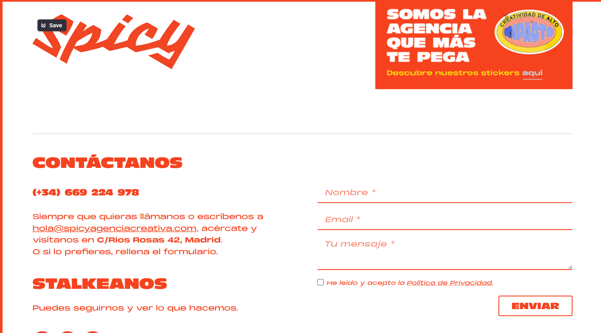

/PROMPT:
Genera el plan de implementcion:

Cambia la sección de contacto con:
✔️ Nombre
✔️ Email
✔️ Mensaje
✔️ botón enviar
✔️ validación simple con JS
con esta estructura: 

Devuélveme:
✔️ HTML
✔️ CSS
✔️ JS validación

Crea el plan de implementación en docs y no lo implementes hasta aprobarlo.
