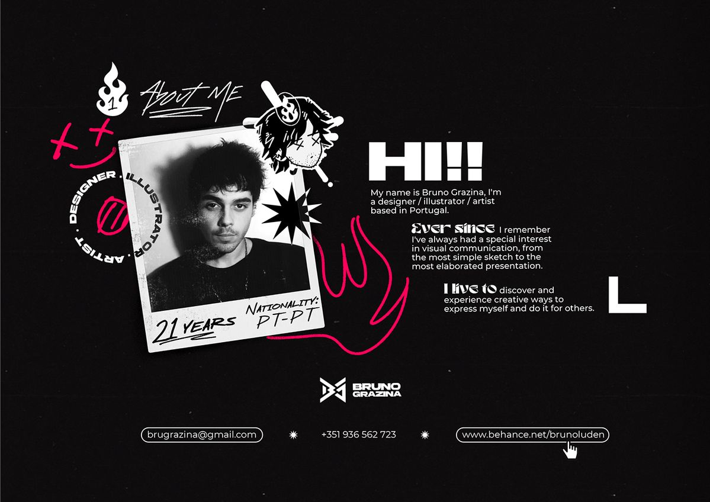

**PROMPT — RESTRUCTURAR SECCIÓN "ABOUT ME" CON LAYOUT VISUAL TIPO COLLAGE EDITORIAL**

Necesito que transformes mi sección actual "Sobre mí" en una nueva estructura visual inspirada en un layout editorial moderno tipo collage como referencia visual: 

OBJETIVO
Rediseñar la sección para que tenga composición gráfica dinámica con:

- foto estilo polaroid inclinada
- elementos decorativos flotantes
- textos en bloque jerárquico
- composición asimétrica

IMPORTANTE
No cambies mis variables CSS globales. Debes usarlas obligatoriamente.

Variables disponibles:assets/css/\_variables.css

ESTRUCTURA HTML REQUERIDA
Debe generarse usando esta jerarquía:

section.about
└── div.about-container
  ├── div.about-visual
  │  ├── div.photo-frame
  │  └── div.decorations
  └── div.about-content

CONTENIDO PLACEHOLDER (NO TEXTO FINAL)
Debes dejar texto ficticio editable:

H1 → "[TITULO PRINCIPAL]"
p → "[DESCRIPCION]"
span → "[ETIQUETA]"

IMAGEN
Debe existir un placeholder para imagen:

ESTILOS REQUERIDOS

- layout grid o flex moderno
- composición asimétrica
- elementos flotantes posicionados absolute
- rotación leve en la foto
- sombras suaves
- responsive mobile-first
- desktop layout dividido visual + texto

EFECTOS VISUALES

- hover sutil en imagen (scale + rotate)
- aparición fade-in al entrar en viewport
- transiciones suaves

DECORACIONES
Incluye shapes vacíos tipo:
div.shape-circle
div.shape-star
div.shape-line

(no usar imágenes, solo CSS shapes)

RESPONSIVE
Mobile → columnas apiladas
Desktop → visual izquierda / texto derecha

OUTPUT
Devuélveme:
✔ HTML limpio
✔ CSS modular comentado
✔ JS opcional solo si es necesario para animación

No uses frameworks.

El resultado debe sentirse moderno, editorial, creativo y propio de portafolio de diseñador visual.

manten la animación de [text](../assets/css/_scrollytelling.css), solo cambia la estructura visual.

Usa la estructura actual y solo modifícala visualmente.

crea el plan de implementación en un documento en docs. No lo implementes hasta aprobarlo.
