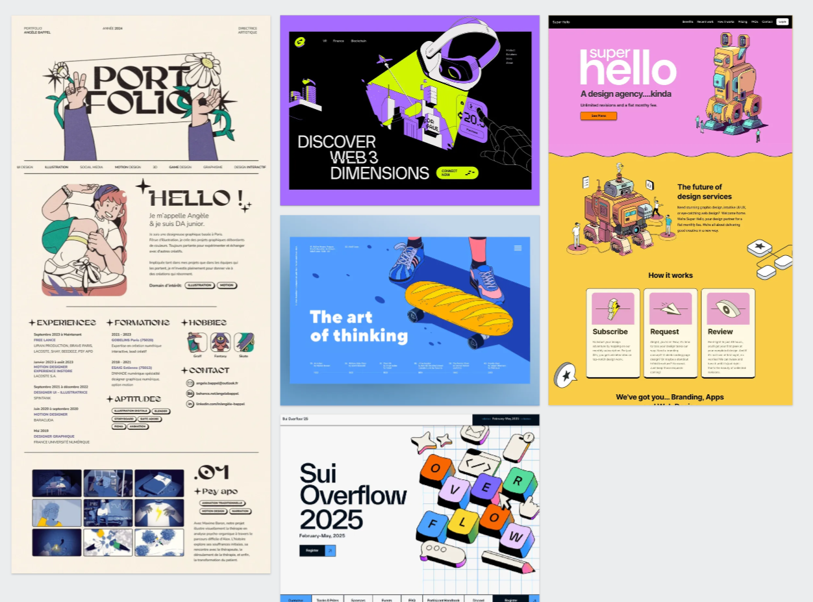

# Project Brief

**Student:** [Romina]  
**Handle:** @[romina_mta_portfolio]  
**Course:** Web Design 2025 · Fall  
**Date:** [Fill in date - Week 2]

---

## Project Concept

### What are you building?

Se llevará a cabo una página donde se alojarán proyectos de ilustración y diseño. Será un portafolio personal que destaque por su autenticidad y la experiencia de usuario. El objetivo es la diferenciación dentro del mercado laboral creativo.

### Who is it for?

El portafolio está dirigido a diseñadores y a profesionales del sector creativo que integran la ilustración en sus proyectos. Se orienta especialmente a agencias publicitarias y editoriales que valoran este recurso como un elemento diferenciador.

### Why does it matter?

Mi propuesta de valor se basa en la integración de la ilustración y el diseño como disciplinas complementarias. A partir de mi bagaje cultural latino, desarrollo nuevas formas de abordar lo visual, priorizando un estilo personal que aporta autenticidad y singularidad al proyecto.

---

## Technical Approach

### Core Technologies

- [x] HTML5 (semantic markup)
- [x] CSS3 (responsive design)
- [x] JavaScript (if applicable)
- [ ] Other: \***\*\_\_\_\*\***

### Accessibility Goals

- [x] Semantic HTML structure
- [x] Proper heading hierarchy
- [x] Alt text for images
- [x] Keyboard navigation support
- [x] Color contrast compliance
- [x] Screen reader compatibility

### Responsive Design Strategy

- [x] Mobile-first approach
- [x] Flexible grid system
- [x] Scalable typography
- [x] Optimized images
- [x] Touch-friendly interactions

---

## Content Strategy

### Key Sections/Pages

1.Banner
2.Sobre mi
3.Proyectos:ILUSTRACIÓN,BRANDING Y SOCIAL MEDIA
4.Contacto

### Decisiones concretas (layout + contenido)

- Layout: galería en grid responsivo basado en CSS Grid — 2 columnas en desktop, 1 en móvil, punto focal en la imagen. Las tarjetas usarán variables de espaciado y color desde `assets/css/_variables.css` para mantener coherencia y facilitar ajustes.
- Contenido por proyecto: cada tarjeta mostrará título, rol (p.ej. ilustración / branding), 3 tags y un CTA «Ver proyecto». La página de proyecto incluirá una imagen principal optimizada (srcset), una breve descripción (1–2 líneas), lista de herramientas y el año.

### Content Sources

<!-- Where will your content come from? -->

El contenido proviene de mi trabajo personal, recopilado durante los años de formación académica y mi experiencia en agencias de diseño.

### Multilingual Considerations

- Primary language:
- Secondary language (optional):
- Translation strategy:

---

## Design Direction

### Visual Style

El estilo visual se basa en lo retro y lo urbano, dos estéticas de interés personal que combinan la cultura con lo contemporáneo. Se prioriza una disposición limpia y legible, con una jerarquía tipográfica construida a partir de fuentes sans serif.

### Color Palette

<!-- List your main colors -->

La paleta utiliza como color principal el azul ultramar, por su capacidad para transmitir confianza y elegancia, acompañado de rojo y tonos vibrantes que refuerzan el carácter urbano mencionado. Esta combinación permitirá diferenciar las secciones de ilustración, branding y social media.

- 

**Notas de implementación (accesibilidad y rendimiento):** usar tokens de color y espacio en `assets/css/_variables.css`; priorizar contraste WCAG AA para textos y CTAs; generar `srcset` y `loading="lazy"` para imágenes de galería.

### Typography

<!-- What fonts/typeface approach will you use? -->

Las fuentes escogidas fueron: Versos text font y Rubik font, por su legibiildad y afinidad gráfica con el proyecto, debido a que dotan características formales del pasado por su origen conceptual basados en el cubo rubick y las tipografías de televisores antiguos. estas destacan porsu toque modreno que les permite adaptarse a cualquier formato.

### Inspiration/References

<!-- List 2-3 websites or designs that inspire your approach -->

- https://www.art-yakushev.com/
- https://rubioydelamo.com/proyecto/diseno-de-paneras-verticales/
- https://www.vasava.es/es
- https://spicyagenciacreativa.com/portfolio/uber-eats-mcdonalds/

---

## Success Metrics

### Week 4 Goals

- [x] Functional homepage
- [x] Basic responsive layout
- [x] Core content in place
- [x] Accessible markup

### Final Project Goals

- [x] Fully responsive across devices
- [x] Meets WCAG 2.1 AA standards
- [x] Fast loading performance
- [x] Complete content
- [x] Polished visual design

---

## Reflection Questions

### What excites you most about this project?

Es interesante realizar un portafolio profesional utilizando herramientas de IA para agilizar la carga de trabajo al usar código.

### What challenges do you anticipate?

Creo que el mayor reto es comprender y usar los diversos lenguajes de programacín sin perderme en el proceso.

### How does this project connect to your learning goals?

---

_This brief will evolve as your project develops. Update it as needed and reference it in your weekly commits._
